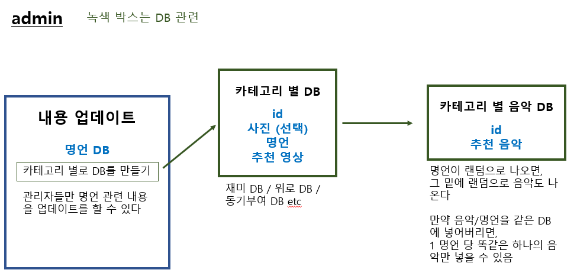
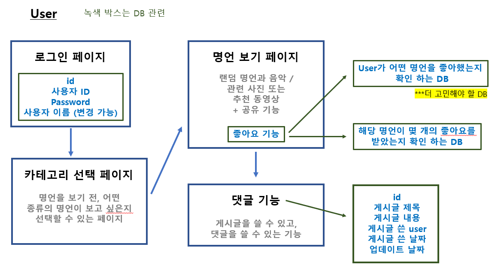

# 🪄코드와트 프로젝트 1: 명언을 담다

[설계](#%EF%B8%8F-설계)

### **What?**

> 하루를 더 힘차게 시작할 수 있는, 또는 해당 서비스를 통해 위로를 받을 수 있는 명언을 사용자들에게 보여 주는 서비스
>
> - 재미, 위로, 동기부여 등 다양한 카테고리를 사용자가 선택
> - 선택하면 랜덤으로 명언들을 보여준다
> - 명언이 마음에 들면 `좋아요` 또는 `공유` 기능을 제공
> - `좋아요`를 통해 이달의 명언을 사용자들이 볼 수 있음
>
> 서비스의 댓글 기능을 통해, 서로 힘이 되어줄 수 있는 댓글 서비스

### **Why?**

> 장고를 배우면서, 배운 기능들을 이 서비스에 업데이트 하면서 복습할 수 있는 좋은 서비스라고 생각
>
> 만약 사용자들이 진짜 생긴다면, 하루하루 사용자들을 위해 힘이 될 수 있는 서비스를 제공

## ✔️ 설계

> admin 페이지 (관리자들만 들어갈 수 있는 페이지)

> user 페이지

